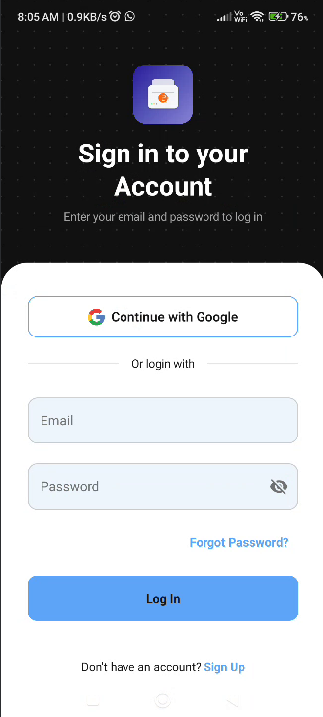
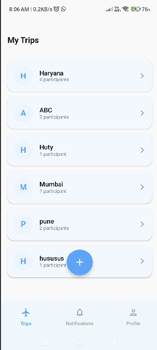
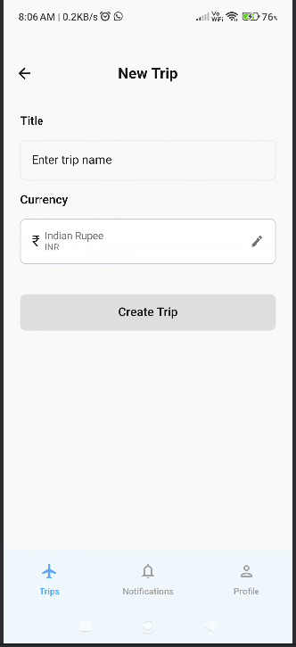
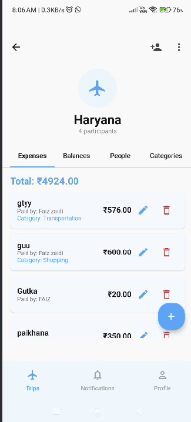
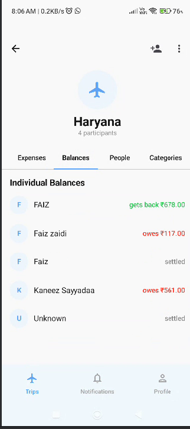
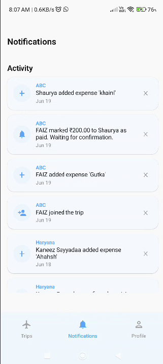

<div align="center">

# ✈️ Trek & Track

**A social trip expense-splitting app for Android**

Plan trips, track shared expenses, and settle up with friends — all in one place.

Built with Kotlin • Jetpack Compose • Firebase

</div>

---

## 📱 About

Trek & Track is a native Android app that makes it effortless to manage group expenses on trips. Create a trip, add participants, log expenses as they happen, and let the app automatically calculate who owes what — no more messy spreadsheets or awkward math after the trip is over.

## ✨ Features

- 🔐 **Secure Authentication** — Email/password login and Google Sign-In via Firebase Auth
- 🧳 **Trip Management** — Create trips with custom titles and currencies, invite participants
- 💸 **Expense Tracking** — Log expenses with categories (Transportation, Shopping, Food, etc.) and see who paid
- ⚖️ **Automatic Balance Calculation** — Real-time individual balances showing who owes and who's owed
- 🔔 **Activity Notifications** — Stay updated when trip members add expenses, mark payments, or join a trip
- 👤 **Profile & Global Summary** — See your total balance across all trips at a glance
- 🌗 **Dark Mode** — Toggle between light and dark themes
- 🗑️ **Account Management** — Delete account with automatic anonymization of your data across shared trips
- 🔄 **Live Sync** — All data synced in real-time via Cloud Firestore

## 🖼️ Screenshots

<table>
  <tr>
    <td align="center"><b>Sign In</b></td>
    <td align="center"><b>My Trips</b></td>
    <td align="center"><b>New Trip</b></td>
  </tr>
  <tr>
    <td></td>
    <td></td>
    <td></td>
  </tr>
  <tr>
    <td align="center"><b>Trip Expenses</b></td>
    <td align="center"><b>Trip Balances</b></td>
    <td align="center"><b>Notifications</b></td>
  </tr>
  <tr>
    <td></td>
    <td></td>
    <td></td>
  </tr>
  <tr>
    <td align="center"><b>Profile</b></td>
    <td></td>
    <td></td>
  </tr>
  <tr>
    <td></td>
    <td></td>
    <td></td>
  </tr>
</table>

## 🛠️ Tech Stack

| Layer | Technology |
|---|---|
| Language | Kotlin |
| UI | Jetpack Compose, Material 3 |
| Architecture | MVVM |
| Authentication | Firebase Auth, Google Sign-In |
| Database | Cloud Firestore |
| Async | Kotlin Coroutines, Flow |
| Navigation | Jetpack Navigation Compose |

## 🚀 Getting Started

### Prerequisites
- Android Studio (latest stable)
- A Firebase project with **Authentication** (Email/Password + Google) and **Cloud Firestore** enabled

### Setup

1. **Clone the repo**
   ```bash
   git clone https://github.com/your-username/trek-and-track.git
   cd trek-and-track
   ```

2. **Add your Firebase config**
    - Download `google-services.json` from your Firebase project console
    - Place it in the `app/` directory

3. **Register SHA-1 / SHA-256 fingerprints** (required for Google Sign-In)
   ```bash
   ./gradlew signingReport
   ```
   Add the printed SHA-1 and SHA-256 values to Firebase Console → Project Settings → Your App, then re-download `google-services.json`.

4. **Set your Web Client ID**
   In `AuthViewModel.kt`, confirm the `requestIdToken(...)` value matches the **Web application** OAuth client ID from your Firebase/Google Cloud project.

5. **Build and run**
   ```bash
   ./gradlew assembleDebug
   ```

## 🔒 Firestore Structure (high level)

```
users/{uid}
trips/{tripId}
  ├── participants: [...]
  ├── expenses/{expenseId}
  └── paid_settlements/{settlementId}
trip_invites/{inviteId}
trip_notifications/{notificationId}
```

## 📌 Status

🚧 Currently in active development — functional and in production testing, not yet published on the Play Store.

## 🤝 Contributing

This is currently a personal/portfolio project. Suggestions and feedback are welcome via Issues.

## 📄 License

This project is open for personal and educational use. Add a license of your choice (MIT recommended) if you plan to open-source it fully.

---

<div align="center">
Made with ❤️ by Faiz
</div>